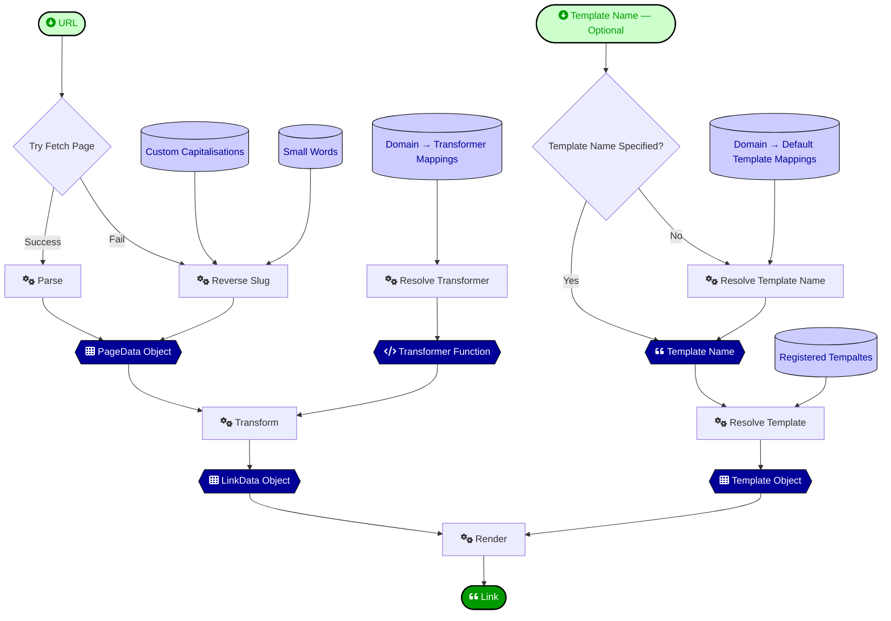

# `linkify` from Bartificer Creations

An MIT-licensed command line app and ES6 Javascript module for generating links in any format from a URL. Users can define their own templates and processing logic in Javascript and templates can utilise information from actual web pages.

[Bart Busschots](https://www.lets-talk.ie/contributor/bart) created this tool to speed up the creation of show notes for the [Let's Talk Apple](https://www.lets-talk.ie/lta) podcast and the [Security Bits](https://www.podfeet.com/blog/category/security-bits/) segments on the [NosillaCast](https://www.podfeet.com/blog/category/nosillacast/). This module is published under an open-source license as a courtesy to other podcasters and bloggers who regularly need to covert URLs into nicely formatted links.

Pull requests and issues are welcomed, but on the understanding that this tool is volunteer-maintained. All responses will be at the Bart's discretion as and when time allows. Realistically, don't expect to hear back for at least a few days, more likely a few weeks, and possibly even a few months.

Given this reality, **use this tool at your own risk!**

# Intended Purpose & Key Features

This module's *raison d'être* is converting URLs to links with the target page's main content title as the link text. To achieve this the module fetches the page's content, parses it with [Cheerio](https://cheerio.js.org), extracts the page title and all top and second-level headings, applies per-domain logic to extract the best title from that data, then uses that to render a link in any format using a [Mustache](https://github.com/janl/mustache.js) template.

This is not a tool for simply converting a URL to a generic link. Unless you need to enrich your links with information from the web pages the links point to, it's probably overkill for you! 

The key features:

1. Meaningful link titles can be programatically extracted from the web pages the URLs point to, and the extraction logic can be customised per domain using *data transformers* (JavaScript functions).
2. Since it has become more common for sites to block scripted downloads (thanks AI!), the tool  falls back to reversing URL slugs to derive meaningful titles when URLs can't be fetched. This reversing is enhanced with a title-case conversation, and that conversion can be configured to adjust the so-called *small words* (those that don't get a leading capital), and to define special words that have custom capitalisations like acronyms and product names, e.g. `NASA` and `iPhone`.
3. Once the data has been extracted, it can be rendered in any format using customisable templates, and these templates can also be assigned on a per-domain basis if needed.
4. All functionality that's attached to domain names is interpreted in a DNS-aware way, so a configuration for a parent domain is inherited by its sub-domains, unless also defined at the sub-domain level. Global defaults can be defined by associating tranformers and templates the root domain (`.`).

To make use of this tool's primary features you need to write your own JavaScript code to define data transformers and templates, and assign them tomdomain names.

The CLI may be useful in its default state, but it was very much **intended to be customised**, and to do that, you need to be able to write at least some basic Javascript.

# Requirements & Assumptions

1. This codebase depends on the [NodeJS Javascript runtime,](https://nodejs.org/en/about) you need to be running [the latest LTS](https://nodejs.org/en/download) (Long Term Support) version to use it.
2. This codebase is only [distributed](https://www.npmjs.com/package/@bartificer/linkify) via the [Node Package Manager](https://www.npmjs.com/) (NPM), you can download the source [from GitHub](https://github.com/bartificer/linkify) and re-bundle it yourself, but if you do, you're going to need to fork the code to remove all the Node dependencies from it!
3. This tool is **intended to be customised**, and to do that, you **need basic Javascript skills**, and an ability to read [API documentation](https://bartificer.github.io/linkify/). You may find some value in using the tool purely in its default state, but you'll regularly need to fix the link text to deal with website peculiarities!

# Installation

This tool is installed via the Node Package Manager (NPM), **before you start, be sure you're running the [latest LTS](https://nodejs.org/en/download) version of NodeJS!**

If you're going to use the command line interface, you need other install the package globally:

```sh
# global install for CLI
sudo npm install --global '@bartificer/linkify'
```

Once the installation completes you can test the it succeeded with the command:

```sh
npx linkify --version
```

If you're only going to use the tool's Javascript modules within a specific project, you should install it locally into your project (rather than globally):

```sh
# local install within a NodeJS project
npm install --save '@bartificer/linkify'
```

# Command Link Tool Overview

The CLI (command line interface) is shipped as a javascript file within the NPN bundle, so the simplest way to run it is to use NodeJS's binary locating and executing tool [NPX](https://docs.npmjs.com/cli/v8/commands/npx) (included with NodeJS):

```sh
npx linkify …
```

The tool implements the sub-command philosophy used by many open source tools like `git`, therefore, all `linkify` commands will take the following form:

```
npx linkify COMMAND [OPTIONS] [ARGUMENTS]
```

The tool offers built-in help, the top-level of which is available via the sub-command `help`:

```sh
npx linkify help
```

This lists the command's global options, and available sub-commands.

To get help on a sub-command, pass that command as an argument to the `help` sub-command, for example, to get help on link generation, use the command:

```sh
npx linkify help generate
```

Here are some of the most useful commands:

```sh
# show the default configuration
npx linkify defaults

# generate a link from a url passed as an argument
npx linkify generate 'https://lets-talk.ie/'

# generate a link by piping a URL to linkify
echo 'https://lets-talk.ie/' | npx linkify generate

# generate a link by reading a URL from the clipboard (copy a link first!)
npx linkify generate --from-clipboard

# generate a link from an argument and send it to the clipboard
npx linkify generate 'https://lets-talk.ie/' --to-clipboard

# generate a link from the clipboard and write it back to the clipboard (copy a link first!)
npx linkify generate --clipboard

# show the active configuration
# help debug your customisations!
npx linkify config

# show the information extracted from the website at a URL
# help write data transformers & templates!
npx linkify page-data 'https://lets-talk.ie/'
```

To better understand how the module works, or, to help debug your customisations, the `--debug` flag enables the printing of debug messages.

# Customising the Tool

There are two types of customisation possible:

1. Define default values for the cli's `generate` action
2. Customise the link generation process

## Customisation Modules

Both forms of customisation are accomplished by writing a configuration module in Javascript. Customisation modules are ES6 Javascript modules that export a single object with two keys, `options` & `linkifier` as the named export `default`.

Specifically, the value of the `options` key should be a plain object where the keys are the names of valid cli options, and the values are strings for options that expect a value, and booleans for options that don't. The only small caveat is that hyphenations options need to be camelCased. Here's the options object Bart uses in his default customisation module:

```javascript
const options = {
    clipboard: true, // equivalent to --clipboard flag
    echoClipboard: true, // equivalent to --echo-clipboard flag (all two-word flags are camelCased)
    template: 'markdown-domain' // equivalent to --template=markdown-domain 
};
```

The value of the `linkifier` key must be an instance of the class `Linkifier` with your desired link generation customisations applied.

You don't have to specify both `options` and `linkifier`, if you only need on type of customisation, it's fine to omit the key you don't need.

Customisation modules should have the following overall structure:

```javascript
import { Linkifier } from '@bartificer/linkify'; // add classes depending on customisation needs

// create and customise a linkifier object
const linkifier = new Linkifier(); // a default linkifier object

// ADD YOUR CUSTOMISATIONS HERE (to linkifier)

// define your desired default cli options
const options = {
    // ADD YOUR OPTIONS HERE 
};

// export your customisations
const config = { linkifier, options };
export {config as default};
```


The command line tool automatically checks for and attempts to import `~/.linkify-config.mjs`, and any customisation module can be specified with the `--config` option.

If you're using the tool within a Javascript project, you can also import the default customisation module, or, a specific customisation module, with the static asynchronous function `Linkifier.importConfig()`, a typical scrip would take the following form:

```javascript
#!/usr/bin/env node

import { Linkifier } from '@bartificer/linkify'; // add classes depending on customisation needs

(async () => { // promise-based, simplest to use async IIFE
    const configObject = await Linkifier.importConfig(); // can pass path as arg
    const linkifier = configObject.linkifier; // instance of Linkifier class

    // CALL ANY INSTANCE FUNCTIONS ON linkifier HERE
})();
```

If you're using the tool within a code base you may not want to load your customisations from an external module, but define them within the script itself, this is a simple pattern for doing that:

```javascript
#!/usr/bin/env node

// import a ready-to-use default Linkify instance with the named import linkify
import { linkify } from '@bartificer/linkify'; // add classes depending on customisation needs

// ADD YOUR CUSTOMISATIONS TO linkify HERE

(async () => { // promise-based, simplest to use async IIFE
    // CALL ANY INSTANCE FUNCTIONS ON linkify HERE
})();
```


# Customising Link Generation

Whether you're adding your link customisations to a customisation module, or, directly into a script, the process is the same.

To succeed you'll need to familiarise yourself with two things:

1. The link generation process the tool uses (described below)
2. The module's API documentation — [https://bartificer.github.io/linkify/](https://bartificer.github.io/linkify/)

The following classes are the most important to familiarise yourself with:

1. `Linkify` — the module's functionality is primarily exposed via instance methods on this class
2. `PagaeData` — the data transformers you write will receive instances of this class as their input
3. `LinkData` — the data transformers you write need to return instances of this class
4. `LinkTemplate` — you define your templates by creating instances of this class

It's also a good idea to familiarise yourself with the content of the `utilities` module. It's not directly exported, but all the functions it provides are made available as both instance and static members of the `Linkifier` class — statically as `Linkifier.utilities`, and as `.util` & `.utilities` on any instance of the `Linkifier` class.

## The Link Generation Process

The module's `generateLink(url)` function is the primary entry point, and the only required argument is a URL.

The first step in the process is to attempt to fetch the page content and extract the relevant information from it. If that fails, the module will attempt to still resolve a title by reversing the URL slug and converting it to title case. Regardless of how the information was gathered, it will be collected into a `PageData` object.

The second step is to convert the `PageData` object to a `LinkData` object, a representing the generic properties of a link — its URL, the link text, and optionally, a link description. This conversion is performed by a *Data Transformer Function*. The module ships with a somewhat intelligent generic data transformer that works for many websites, but you will inevitable need to define your own transformers and assign them to specific sub-domains. The module uses the domain part of the URL to determine which transformer to run.

The final step in the process is to render the link by passing the `LinkData` object to a `LinkTemplate` object. Link templates always contain a Mustache template string defining the output link's structure, but that can also contain *Field Filter Functions* which sanitise the contents of the different fields in some way. Any function that takes a single string as input and produces a new string as an output can be used as a filter function. The module ships with a few commonly needed filter functions:

1. `linkify.util.regulariseWhitespace(text)` to replace all white space, even new lines and tabs, with single regular spaces.
2. `linkify.util.stripQueryString(url)` to remove the query string entirely
3. `linkify.util.stripUTMParameters(url)` to remove tracking parameters from the query string.

Like data transformers, the domain part of the URL can be used to determine the template to use, though in most cases, you'll want to use your default template, which you should assign to the root DNS name, i.e. `.`.

This entire process, including the customisations to the reversing of URL slugs, is illustrated in the [Mermaid](https://mermaid.ai/open-source/) diagram below:



## Customisation Points

TO REVIEW

In the diagram above the customisation points are the data stores, rendered with the standard cylindrical database icon. To successfully customise the module it's vital to familiarise yourself with the module's API. The source code has been extensively documented with [JSDoc annotations](https://jsdoc.app), allowing the following documentation to be generated — [bartificer.github.io/linkify](https://bartificer.github.io/linkify/).

To get you started, here's a quick summary of some recommended steps for building an effective link generation script:

1. Use an expanded import with at least the following:
   ```javascript
   import {linkify, LinkData, LinkTemplate} from '@bartificer/linkify';
   ```
2. If none of the out-of-the-box templates are appropriate (`linkify.templateNames` is the array of registered template names), register a custom template of you own and make it the default. For example:
   ```javascript
   // register a template for Markdown links with an emoji pre-fixed
   linkify.registerTemplate('md-emoji', '🔗 [{{{title}}}]({{{url}}})');
   
   // make the new template the default for all domains
   linkfiy.registerDefaultTemplateMapping('.', 'md-emoji');
   ```
3. If the default data transformer's logic doesn't fit your needs, register a new default. For example:
   ```javascript
   linkify.registerTransformer('.', (pData) => { // registering to the root domain .
     // sanitise the URL
     const url = linkify.util.stripUTMParameters(pData.url);
     
     // use the main heading (first h1, if any, or first h2) as the intial text and description
     // collapse the white space first
     let text = linkify.util.regulariseWhitespace(pData.mainHeading);
     const description = text;
     
     // truncate the text if needed
     if(text.length > 20){
       text = text.substring(0, 19) + '…';
     }
     
     // build a link data object and return it
     return new LinkData(url, text, description);
   });
   ```
4. Register all needed domain-specific custom transformers. For Example:
   ```javascript
   linkify.RegisterTransformer('some.domain', (pData) => { new LinkData(pData.url, pData.h1s[1]) });
   ```
5. Fine-tune the reversing of URL slugs by adding additional words with custom capitalisations and/or small words that remain lower-case when converted to title case. For example:
   ```javascript
   linkify.smallWords.add('regardless');
   linkify.speciallyCapitalisedWords.add('UNICEF');
   ```
6. Sometimes, a different template is required for a specific domain, in that case, assign the desired template at the domain level. For example:
   ```javascript
   // create a special template for your home domain
   linkify.registerTemplate('md-home', '🏠 [{{{title}}}]({{{url}}})');
   
   // set that template as the default for just your domain (and its subdomains)
   linkfiy.registerDefaultTemplateMapping('your.home.domain', 'md-home');
   ```

## Advanced Usage — Tempalte with Extra Field Extractor

Very rarely, a template needs access to information that's not extracted from the page source by default. This is possible with the use of an *Extra Field Extractor* function. Under the hood, the process is spread out over a number of classes, but from to keep things simple for users, the public interface to this functionality is entirely contained with the `LinkTemplate` class's constructor.

To create a template that uses extra fields you must:

1. Pass a custom field extractor function as the optional third argument to the `new LinkTemplate()` constructor.
   * This function will be passed just one argument, a [Cheerio object](https://cheerio.js.org/docs/api/classes/cheerio/) representing the web page's parsed DOM.
   * This function **must** return a plain object mapping field names to string values.
2. In the template string, reference the fields extracted by the extractor function as keys on the object `extraFields`. For example, if your extractor function returned fields named `permalink` and `volume`, those two fields should be accessed as `extraFields.permalink` & `extraFields.volume` in the template string.

As a practical example, here's a custom template to render XKCD comics as Markdown links followed by markdown images, with the comic number, comic title, comic permalink, and comic image URL extracted from the DOM as extra fields and referenced in the template string:

```javascript
// register a special Markdown template for XKCD cartoons and make it the default for XKCD's domain
linkify.registerTemplate('md-xkcd', new LinkTemplate(
    '[XKCD {{{extraFields.comicNumber}}}: {{{extraFields.title}}}]({{{extraFields.permalink}}})\n',
    null, // no field filters
    ($) => { // a custom field extractor function
        const $img = $('div#comic img').first(); // the cheerio selector to find the comic image
        const $comicLinks = $('div#middleContainer > a'); // the cheerio selector to find the two permalinks
        const permalink = $comicLinks.first().attr('href'); // the first permalink of the two is the one for the page
        const imageLink = $comicLinks.last().attr('href'); // second permalink of the two is the one for the image
        const comicNumber = permalink.match(/(?<comicNum>\d+)\/?$/).groups.comicNum;
        return {
            title: $('div#ctitle').text(), // capture the comic's title
            hoverText: $img.attr('title').replaceAll('"', '\\"'), // capture the all important hover text!
            imageLink,
            permalink,
            comicNumber
        };
    }
));
linkify.registerDefaultTemplateMapping('xkcd.com', 'md-xkcd');
```

# Real-World Examples

TO UPDATE

Two real-world scripts Bart uses to build shownotes are included in[the [`/example` folder in the GitHub repostitory](https://github.com/bartificer/linkify/tree/master/example):

1. `clipboardURLToMarkdown.mjs` — the script Bart uses to convert links to Markdown for use in show notes. This script contains a real-world example of a custom template, and, of a large collection of custom transformers registered against specific domain names for dealing with their various quirks.
2. `debugClipboardURL.mjs` — the script Bart uses to help develop custom transformers for any sites that need them.