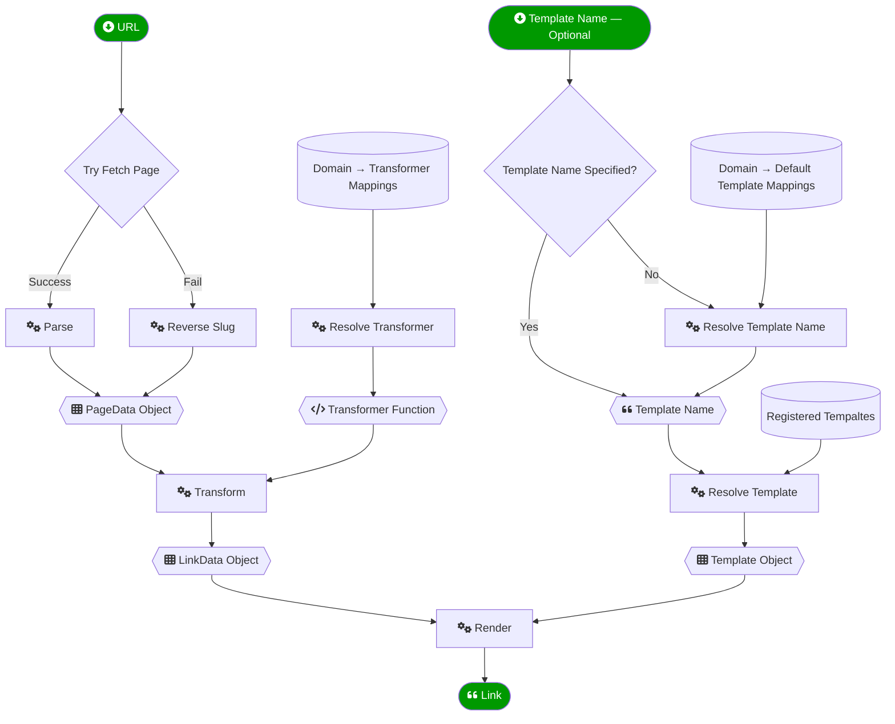

# `linkify` from Bartificer Creations

An MIT-licensed ES6 Javascript module for generating links in any format from a URL.

This code was written by [Bart Busschots](https://www.lets-talk.ie/contributor/bart) to speed up the creation of shownotes for the [Let's Talk Apple](https://www.lets-talk.ie/lta) and the [Security Bits](https://www.podfeet.com/blog/category/security-bits/) segments on the [NosillaCast](https://www.podfeet.com/blog/category/nosillacast/). It is released open-source as a courtesy to other podcasters and bloggers who regularly need to covert URLs into nicely formatted links.

Pull requests and issues are welcomed, but on the understanding that this is a volunteer-maintained package, and all responses will be at the maintainer's discression as and when they have time. Realistically, you won't hear back from days or weeks, and if life is very hectic, perhaps even months.

Given this reality, **do not use this repository for anything mission-critical!**.

# Intended Purpose & Key Features

This module's reason for existing is to take a URL, fetch and parse the web page's HTML to extract the page and section titles, pass the extracted data through a transformer function appropriate for the domain to extract the page's title, then render that to a link in any language using a desired template.

This is not a module for simply converting a URL to a generic link. What makes it different is:

1. Link titles are automatically exctracted from the actual web page using customiusable *data transformers*
2. Links can be rendered in any language using customisible templates.
3. Web page processing functions and output templates are associated with domain names in a DNS-aware way

Data transformers and templates are resolved using the DNS hierarchy. For example, if you register a data transformer for the domain `bartificer.ie`, and then you process a link on the `www.bartificer.ie` domain, the module will first check if there is a transformer registered for `www.bartificer.ie`, if not it will find the  one registered for `bartificer.ie` and use that. This means that the data transformer and template registered against the DNS root domain `.` acts as defaults for all domains that don't have their own custom settings.

To use this module you will need to write your own NodeJS script that:

1. Imports this module
2. Registers your required templates and data transformers
3. Invokes the module's link generation function

If this is more than you need, this module is not for you!

# Instalation & Minimal NodeJS Example

Before you begin, make sure you have [the latest LTS version of NodeJS](https://nodejs.org/en/download) installed!

Create an empty folder and open a shell in that folder.

First, install the module into your folder with the command:

```sh
npm install '@bartificer/linkifier';
```

Test the module is working with a basic script that uses all the defaults and makes no customisations. Create a file named `test.mjs` with the following content:

```javascript
import { linkify } from '@bartificer/linkify';

(async () => {
    console.log(await linkify.generateLink('https://github.com/bartificer'));
})();
```

Execute this script with the command:

```sh
node ./examples/clipboardURLToMarkdown.mjs
```

This should print an HTML link to this module's Git repository.

# Customising Link Generation

The module is very much intended to be customised, and while the module has been designed to make your customisation code concise and as self-documenting as possible, it's vital to understand the module's process for generating links.

## The Link Generation Process

The module's `generateLink(url)` function is the primary entry point, and the only required argument is a URL.

This URL will be converted to a `PageData` object which capture's the various titles and headings found on the page.

Based on the URL's domain, a *data transformer* will be resolved, and that function will convert the `PageData` object to a `LinkData` object containing just the fields needed to render a link.

Based on the URL's domain, a `LinkTemplate` will be resolved, and that template will be combined with the `LinkData` object to render the link.



## Customisation Points

To customise the module effectively you'll need the API documentation — [bartificer.github.io/linkify](https://bartificer.github.io/linkify/).

Before rendering links, you should do the following:

1. Use an expanded import with at least the following:
   ```javascript
   import {linkify, LinkData, LinkTemplate} from '@bartificer/linkify';
   ```
2. If none of the out-of-the-box templates are appropriate (`linkify.templateNames` is the array of registered template names), register a custom template of you own and make it the defaukt. For example:
   ```javascript
   // register a template for Markdown links with an emoji pre-fixed
   linkify.registerTemplate('md-emoji', '🔗 [{{{title}}}]({{{url}}})');

   // make the new template the default for all domains
   linkfiy.registerDefaultTemplateMapping('.', 'md-emoji');
   ```
3. If the default data transformer's logic does not fit with your needs, register a new default. For example:
   ```javascript
   linkify.registerTransformer('.', (pData) => { new LinkData(pData.url, pData.title.replace(/ · GitHub$/, ' on GitHub')) });
   ```
4. Register all needed domain-specific custom transformers. For Example:
   ```javascript
   linkify.RegisterTransformer('some.domain', (pData) => { new LinkData(pData.url, pData.h1s[1]) });
   ```
5. Very rarely, a different tempalte is required for a given domain, in that case, assign the desirec tempalte at the domain level. For example:
   ```javascript
   // create a special template for your home domain
   linkify.registerTemplate('md-home', '🏠 [{{{title}}}]({{{url}}})');

   // set that template as the default for just your domain (and its subdomains)
   linkfiy.registerDefaultTemplateMapping('your.home.domain', 'md-home');
   ```

# Real-World Examples

_**Note:** these examples are written to work on a development clone of the module, to use them outside of that, change the import statements to import from `'@bartificer/linkify'` rather than `'../dist.index.js'`. Alternatively, fork, download and build the module (`npm ci && npm run build`)._

Two real-world scripts Bart users to build shownotes are included in [the `/example` folder in the GitHub repostitory](https://github.com/bartificer/linkify/tree/master/example):

1. `clipboardURLToMarkdown.mjs` — the script Bart uses to convert links to Markdown for use in show notes. This script contains a real-world example of a custom template, and, of a large collection of custom transformers registered against specific domain names for dealing with their various quirks.
2. `debugClipboardURL.mjs` — the script Bart uses to help develop custom transformers for any sites that need them.